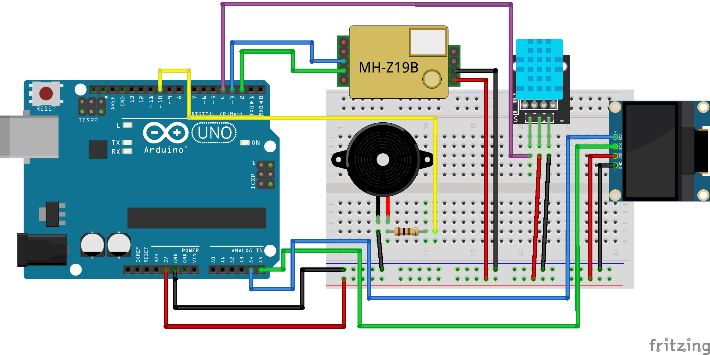

# Classroom Air Quality Monitor

An Arduino-based classroom air quality monitor that measures **CO₂ concentration**, **temperature**, and **humidity**, displaying the information on an OLED screen and warning users when CO₂ levels become too high.

This project was designed for educational environments and can be used by students to learn about electronics, sensors, programming, environmental monitoring, and data collection.

## Features

- Measures CO₂ concentration using an **MH-Z19B** sensor.
- Measures temperature and humidity using a **DHT11** sensor.
- Displays all readings on a **128×64 OLED screen**.
- Activates a buzzer when CO₂ levels exceed a predefined threshold.
- Easy to build using common Arduino components.
- Suitable for STEM, Technology, Computer Science, Physics, and Environmental Science lessons.

## Components Required

| Component | Quantity |
|------------|------------|
| Arduino UNO R3 | 1 |
| MH-Z19B CO₂ Sensor | 1 |
| DHT11 Temperature & Humidity Sensor | 1 |
| SSD1306 OLED Display (128×64, I²C) | 1 |
| Active Buzzer | 1 |
| Breadboard | 1 |
| Jumper Wires | Several |
| USB Cable | 1 |
| 100 Ω Resistor | 1 |

## Wiring Diagram

The complete wiring diagram can be found below:

---

## Pin Connections

### OLED Display (SSD1306)

| OLED | Arduino UNO |
|--------|--------|
| VCC | 5V |
| GND | GND |
| SDA | A4 |
| SCL | A5 |

### MH-Z19B CO₂ Sensor

| MH-Z19B | Arduino UNO |
|--------|--------|
| VCC | 5V |
| GND | GND |
| TX | Pin 2 |
| RX | Pin 3 |

### DHT11 Sensor

| DHT11 | Arduino UNO |
|--------|--------|
| VCC | 5V |
| GND | GND |
| DATA | Pin 4 |

### Buzzer

| Buzzer | Arduino UNO |
|--------|--------|
| Positive (+) | 100Ω Resistor - Pin 10 |
| Negative (-) | GND |

---

## Libraries Required

Install the following libraries using the Arduino IDE Library Manager.

### DHT Sensor Library

- **Library:** DHT sensor library
- **Author:** Adafruit

### Adafruit Unified Sensor

- **Library:** Adafruit Unified Sensor
- **Author:** Adafruit

### Adafruit SSD1306

- **Library:** Adafruit SSD1306
- **Author:** Adafruit

### Adafruit GFX Library

- **Library:** Adafruit GFX Library
- **Author:** Adafruit

## How It Works

The Arduino continuously reads data from:

- The MH-Z19B CO₂ sensor.
- The DHT11 temperature and humidity sensor.

The readings are displayed on the OLED screen every few seconds.

When the measured CO₂ concentration exceeds the warning threshold (default: **1500 ppm**), the buzzer is activated to indicate that the room should be ventilated.

## Understanding CO₂ Levels

| CO₂ Level | Air Quality |
|------------|------------|
| 400 – 800 ppm | Good |
| 800 – 1200 ppm | Moderate |
| 1200 – 1500 ppm | Poor |
| Above 1500 ppm | Ventilation Recommended |

> **Note:** CO₂ levels vary depending on the room, occupancy, and ventilation. These values should be considered general guidelines rather than strict limits.

## Future Improvements

Possible extensions for this project include:

- Logging data to Google Sheets.
- WiFi connectivity using an ESP8266.
- SD card data storage.
- Real-time web dashboard.
- Multiple classroom monitoring system.
- Historical data analysis and graph generation.
